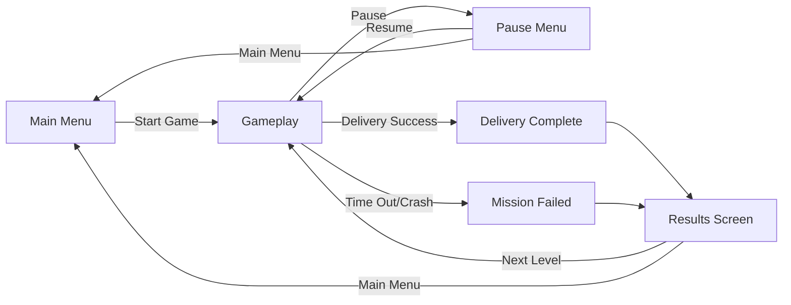
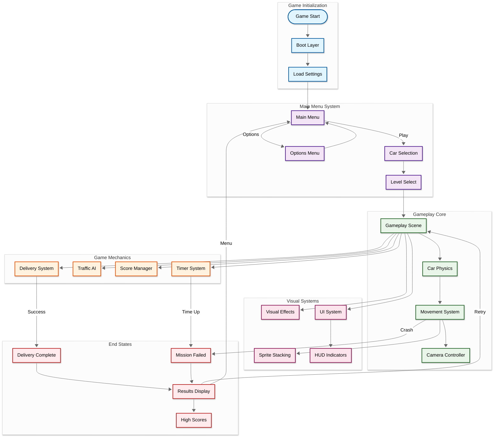
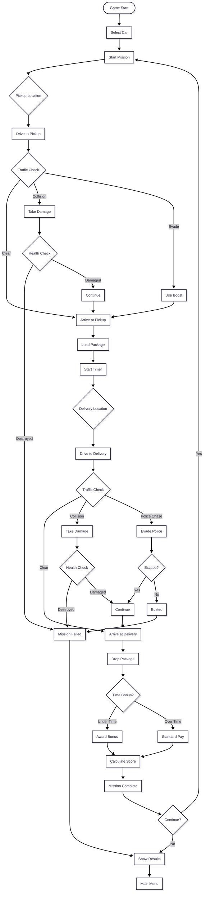
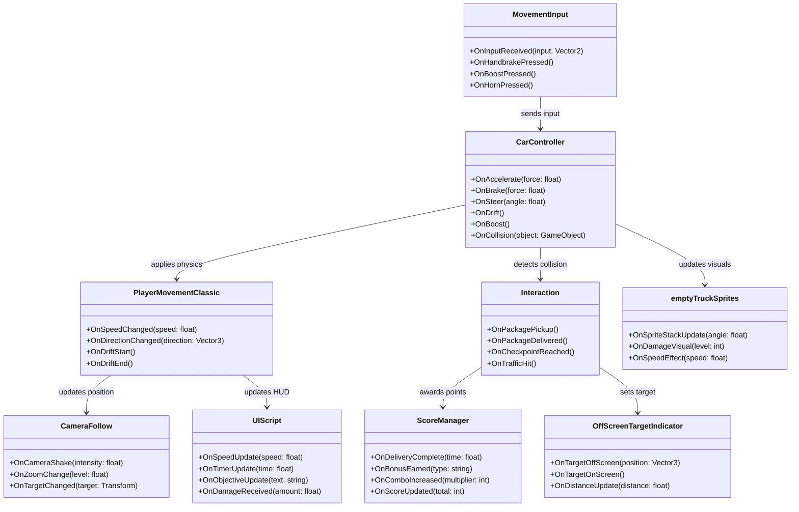

## Developer & Contributions

Adiguna S Ligawan (Game Developer & Systems Designer)
   

## About

Delivery Rush is a high-octane arcade delivery game that combines the thrill of high-speed driving with strategic package delivery missions. Built with innovative sprite stacking technology to achieve a unique pseudo-3D look using 2D pixel art, the game features realistic car physics with velocity-based movement, acceleration curves, and responsive turning mechanics. Navigate through busy city streets, evade traffic, escape police chases, and deliver packages on time to earn high scores in this fast-paced, endlessly replayable arcade experience.
 

## Key Features

**Sprite Stacking Technology**: Innovative visual technique that creates stunning pseudo-3D graphics from 2D pixel art, giving the game a unique and stylish appearance.

**Realistic Car Physics**: Velocity-based movement system with proper acceleration, braking, drifting, and turning mechanics that make every delivery feel authentic and exciting.

**High-Speed Delivery Gameplay**: Intense time-based missions where you must pickup and deliver packages while avoiding traffic, police, and other obstacles.

**Arcade-Style Action**: Fast-paced, pick-up-and-play gameplay with tight controls, combo systems, and high score chasing for maximum replayability.

 

<table>
  <tr>
    <td align="left" width="50%">
      
    </td>
    <td align="right" width="50%">
      
    </td>
  </tr>
</table>

## Scene Flow 

## Layer / Module Design 

## Modules and Features

A high-speed arcade delivery game featuring innovative sprite stacking for pseudo-3D visuals, realistic car physics with velocity and acceleration, and intense traffic evasion gameplay that creates thrilling delivery missions through busy city streets.

| 📂 Name | 🎬 Scene | 📋 Responsibility |
|---------|----------|-------------------|
| **CameraFollow** | **Gameplay** | - Follow player car smoothly - Handle camera shake effects - Manage zoom levels for speed effects |
| **CarController** | **Gameplay** | - Handle car physics (velocity, acceleration, braking) - Process steering and turning mechanics - Manage drift and traction systems |
| **Interaction** | **Gameplay** | - Handle delivery pickups and drop-offs - Process collision with traffic - Manage checkpoint interactions |
| **MovementInput** | **Gameplay** | - Capture player input (keyboard/gamepad) - Process acceleration and steering inputs - Handle handbrake and boost controls |
| **OffScreenTargetIndicator** | **UI/Gameplay** | - Show direction to delivery targets - Display distance to objectives - Indicate off-screen traffic threats |
| **PlayerMovementClassic** | **Gameplay** | - Classic arcade car movement physics - Handle speed limits and boost mechanics - Process collision responses |
| **ScoreManager** | **Gameplay** | - Track delivery times and bonuses - Calculate score based on performance - Manage combo multipliers |
| **UIScript** | **UI System** | - Display speedometer and timer - Show delivery status and objectives - Update score and combo displays |
| **carNew** | **Gameplay** | - Store car properties and stats - Handle car customization data - Manage vehicle damage states |
| **emptyTruckSprites** | **Visual** | - Manage sprite stacking layers - Handle truck visual components - Process damage visuals |
| **mouse** | **Input** | - Handle mouse input for menus - Process mouse camera controls - Manage UI interactions |

 

## Game Flow Chart

 

## Event Signal Diagram

 

## Play The Game

<a href="#">Play Now</a>
 

